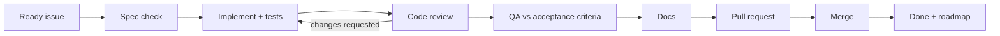

# The agent team

> Written by `/fw-team`. One section per agent, in plain language: what it does, when it
> steps in, what it never does, how to call it directly.

## How a story flows

```mermaid
flowchart LR
  ready[Ready issue] --> spec[Spec check] --> impl[Implement + tests] --> review[Code review]
  review -- changes requested --> impl
  review --> qa[QA vs acceptance criteria] --> docs[Docs] --> pr[Pull request] --> merge[Merge] --> done[Done + roadmap]
```
