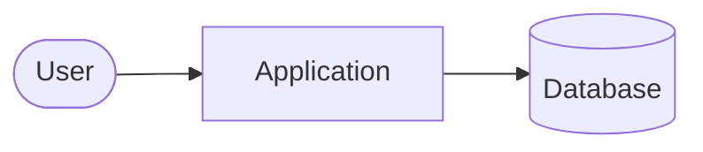

# Architecture overview

> Filled by `/fw-init` (from the brief for a new project, from the code for an adopted one)
> and kept current by the docs agent.

## Big picture

## Components
| Component | Responsibility | Location in the repo |
|---|---|---|
| | | |

## Data model
<!-- Main entities and relations; a Mermaid erDiagram is welcome. -->

## Cross-cutting concerns
<!-- Authentication, configuration, logging, errors, i18n, security. -->

## Decisions
See [decisions](decisions/README.md).
