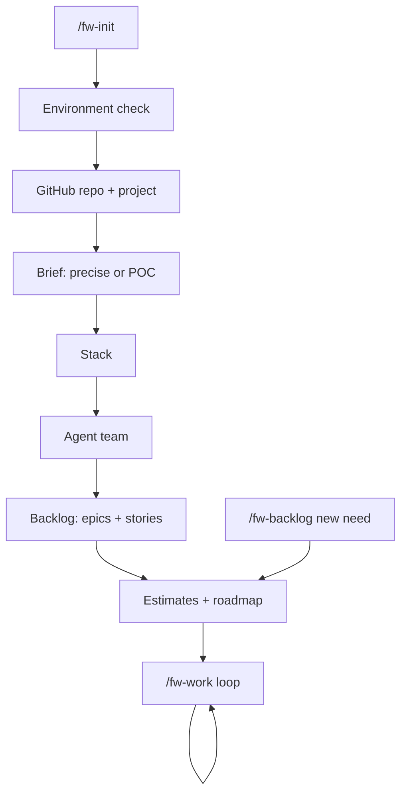

# Workflow

## 1. Initialization (`/fw-init`, once)
1. **Environment** — git, GitHub CLI, authentication, token scopes (`repo`, `project`,
   `workflow`). The agent guides every fix.
2. **Language** — conversation, issues (your language or English), docs.
3. **Autonomy** — assisted or fully automatic (see [autonomy](autonomy.md)).
4. **GitHub** — repository on your account, a Project (Kanban + Roadmap) linked to it,
   custom fields, labels. New project or adoption of an existing repository.
5. **Brief** — *precise* (structured interview, predictable result) or *exploratory*
   (three questions, the agent makes explicit assumptions — ideal for a POC).
6. **Stack** — imposed by you, or recommended with reasons (versions checked online).
7. **Agent team** — recommended from the stack and the brief; you choose. Each agent is
   written for this project against a quality standard.
8. **Backlog** — milestones, epics, user stories with acceptance criteria, success measure
   and estimate; you review before anything is created on GitHub.
9. **Roadmap** — capacity questions, estimate discussion, dates written to GitHub.
10. **Docs** — brief, architecture, guides, team, glossary; first commit and push.

## 2. Daily loop (`/fw-work`)
For each ready story: spec check → implementation with tests → code review (up to 3 rounds)
→ QA against every acceptance criterion → docs → pull request → CI → merge → board and
roadmap updated, actual time recorded. Blocked items get the `needs-human` label with a
precise question, and the loop moves on.

## 3. New needs (`/fw-backlog`)
Describe a feature or a bug in your words; the agent checks for duplicates, writes
qualified items attached to the right epic, estimates them and re-plans.

## 4. Estimates
Hours of agent work + hours of your review, sizes XS–L (XL must be split). Actual time is
recorded when a story is done, and `/fw-status` shows how accurate estimates are.
